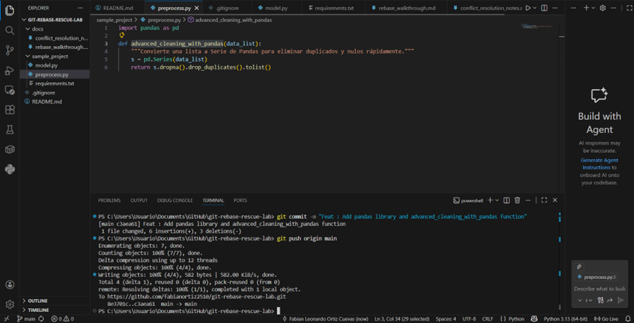

# REBASE PROBLEM
## STRUCTURE


I have a repositore with follow structure

```
git-rebase-rescue-lab/
├── README.md
├── sample_project/
│   ├── preprocess.py
│   ├── model.py
│   └── requirements.txt
└── docs/
    ├── rebase_walkthrough.md
    └── conflict_resolution_notes.md

```

` codigo `
``` PYTHON 
A=3
def
```


Que me genere un markdown con bloque de codigo del procedimiento que realice