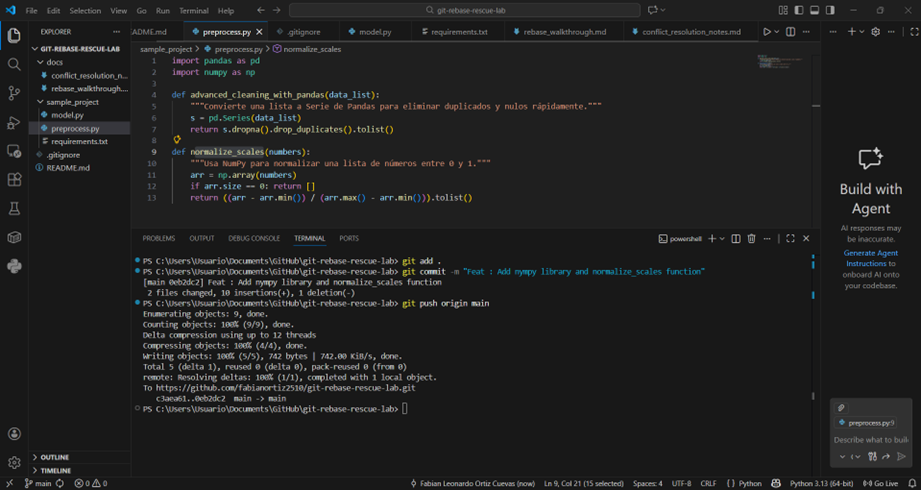
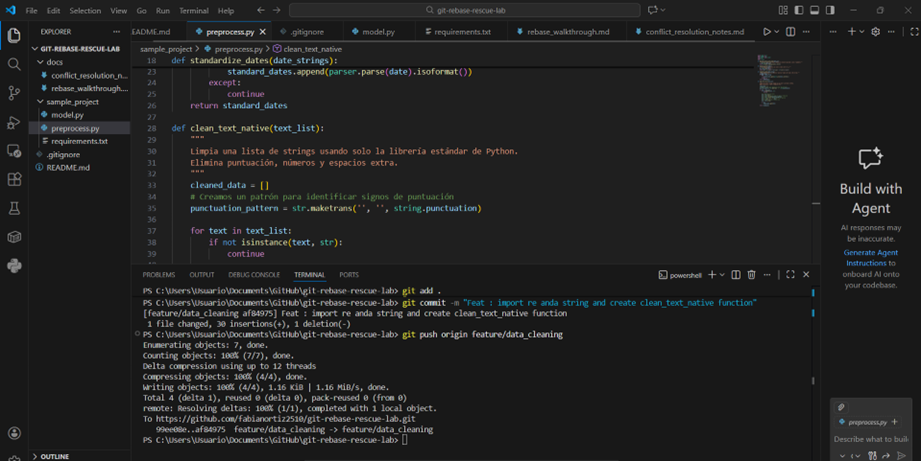
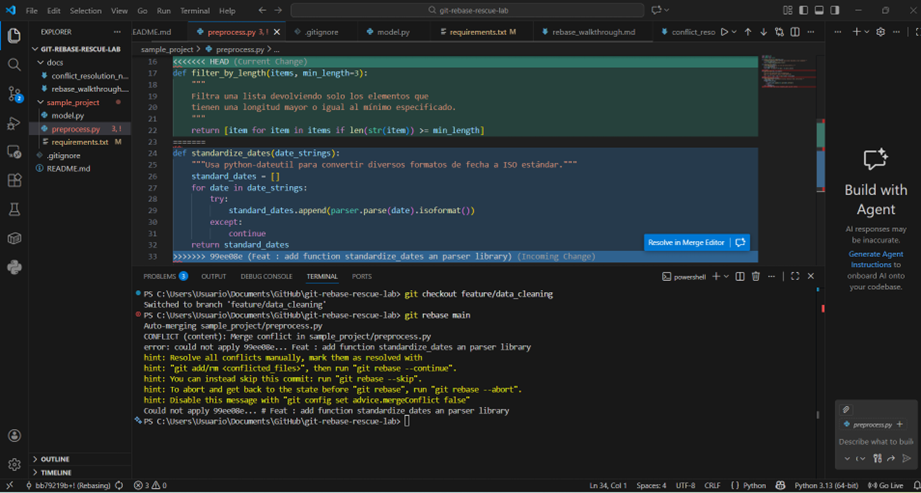
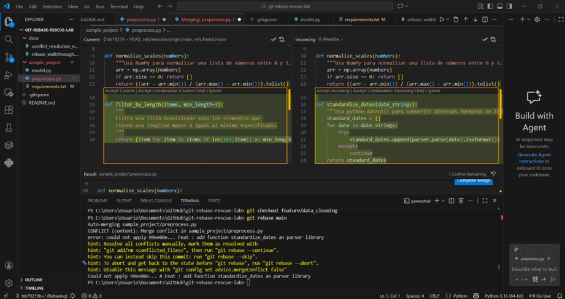
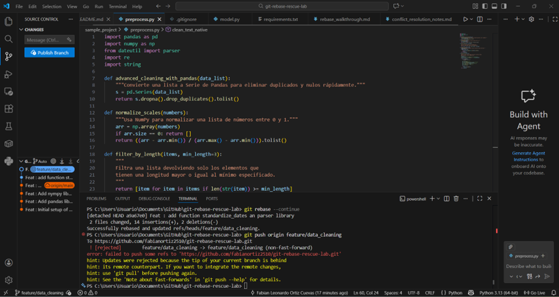
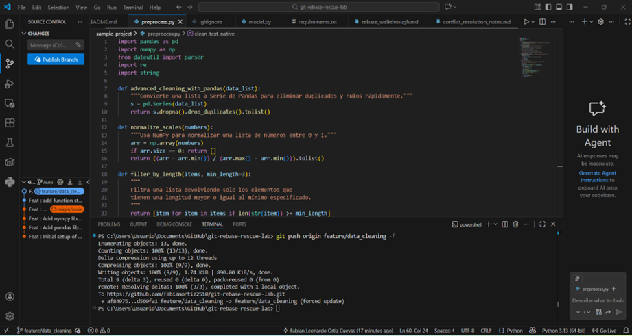

# REBASE PROBLEM
## STRUCTURE


I have a repositore with follow structure

```
git-rebase-rescue-lab/
├── README.md
├── sample_project/
│   ├── preprocess.py
│   ├── model.py
│   └── requirements.txt
└── docs/
    ├── rebase_walkthrough.md
    └── conflict_resolution_notes.md
```
Se realiza el commit con la estructura del proyecto como se observa en la siguiente imágen.


Se realiza la creación del escenario en el cual inicialmente en la rama main realizando tres  commits; A y B.

Commit A (Rama main): 


Commit B (Rama main): 
 
 

Se realiza la creación de la otra rama: feature/data-cleaning y se realiza un commit D creando otra función 

Commit 4 (feature/data-cleaning): 



Posteriormente se vuelve a la rama main y se crea otra función:


Posteriormente se vuelve a la rama feature/data-cleaning y se realiza rebase creando un conflicto.





Cuando se observan los errores en la codificación de las dos ramas. Para este caso se da click en "Accept Combination" para no perder ninguna funcionalidad.

Posteriormente se realiza un push normal el cual es denegado debido a que git interpreta  que si acepta el push normal perderá información antigua.



La solución para que ignore el historial anterior y acepte la nueva estructura del repositorio, se realiza un push forzado solucionando el conflicto que se habia generado.

