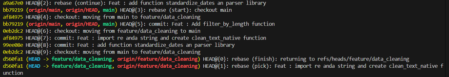
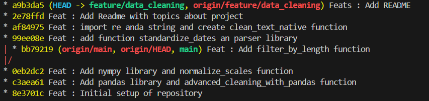

# REBASE PROBLEM
## STRUCTURE

This repository is designed to assure the modularity and the final documentation and record for project branch management, in this case it was settled a shared environment to take control over required changes and adjustments during the development process.

The project was designed based on the following structure:


```
git-rebase-rescue-lab/
├── README.md
├── sample_project/
│   ├── preprocess.py
│   ├── model.py
│   └── requirements.txt
└── docs/
    ├── rebase_walkthrough.md
    └── conflict_resolution_notes.md
```

## DEPLOYMENT 

It was pushed the commit acordin to the instructions showed below.


It was created the first scenario where adjustments are controlled in the main branch.

### Commit A (main branch): Create the first function for data processing.


### Commit B (main branch): Create the second function for data processing.
 
 

Create the branch "feature/data-cleaning" and push the commit creating another function.

### Commit 4 (feature/data-cleaning): 


Subsequently return to the main branch and create the function


Then,  back to the "feature/data_cleanuing" branch a rebase is made to create a conflict.


When any issue is found in the process for both branches. Is possible to fix it by clicking on "Accept Combination" ro recover all functions. After that, it is executed a normal push that is denied at this point because git recognize a normal push as a loss of information. 


The way to ignore th previous information in both branches and set the new repository structure, is through a forced push to solve the previous conflict.


As part of the verification and security protocol, it was used a "git reflog" command in order to verify the commit history within the project and visualize it with conflict correction.



Finally its executed a "git log --oneline --graph --decorate --all" command where the structure repository is showed and a clean an linear structure is obtained.



Author: Fabian Leonardo Ortiz Cuevas

Electronic Engineer

Email: fabioleorcu20@gmail.com 